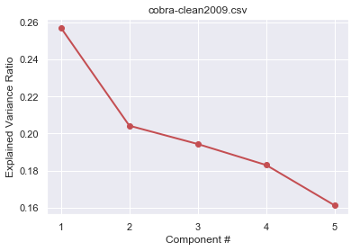
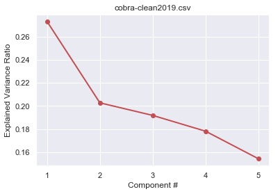
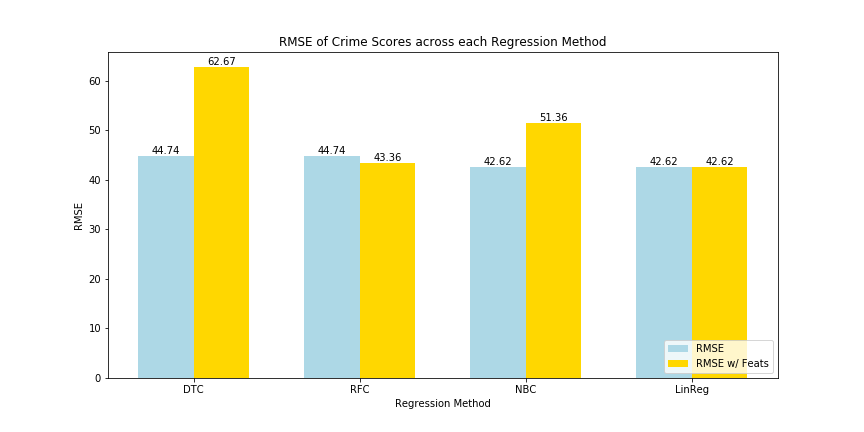

# Atlanta Crime Mapping for CS7641 - Group 17
#### Abdurrahmane Rikli, Gabriel Leventhal-Douglas, Kevin Tynes, Aayush Dubey, and Sanjeev Prasada

# Introduction
## Motivation
In Atlanta, the overall crime rate is 108% higher than the national average. Crime is an ever-present concern. With almost 30 thousand crimes a year and a 61% crime rate per capita, Atlanta is one of the 3% most dangerous cities in the United States [1]. With such issues, the police force cannot deal with crime on a case-by-case basis. They need to be directed to crime-heavy areas preemptively.

#### What are you trying to do to tackle with your project motivation or problem?
Sufficient patrols in crime-heavy areas can be achieved using a prediction model to estimate the areas with the most severe crimes. More dangerous crimes can be preempted. With a real-time updating machine learning model, the police force can consistently catch up with crimes before they even occur day by day, and more often than not, their presence alone is enough to prevent crimes from occurring. Overall, as long as informative data is fed into the model, average crime rate is sure to consistently drop.

We reviewed literature of machine learning crime prediction methods using spatial [5, 3] and temporal [2] data in conjunction with crime-type. We will build upon this prior work by applying these methods to Atlanta crime data and improving predictive model efficiency.

#### What have people already done?
References are important. We may need to reference our proposal here and summarize our literature review. Will work on this tonight after dinner (post 9pm).
Crime statistics -likelihood for the most part- were pridected per 100k people in the state of Mississipi, irrespective of any features aside from the state's crime type statistics in their paper[2]. For the most part, time and space relevant features were examined only within the context of splitting areas into grids, and predicting intensity and displacement[3], although there were some attempts at clustering crime occurrences [5]. Closest to our approach was an attempt at predicting crime occurrences through similar features using KNN and Boosted Decision Tree, although the accuracy was 44% at its highest[4].

## Dataset (Needs description of features, accessability, etc.)
Our dataset comes from the Atlanta PD Crime Statistics dataset publicly available on [website](https://www.atlantapd.org/i-want-to/crime-data-downloads). This data is available as two separate datasets 'COBRA-2009-2018' and 'COBRA-2019'. After analyzing the Atlanta PD Crime dataset from 2009-2018, the most popular crimes in descending order are larceny from vehicle, larceny non vehicle, burglary at residence, and automobile theft. Our dataset is record-based; each row in the dataset represents one crime and the features of that crime (represented below in tables). We have a total of 20 features per record and a total of 317,905 records of crime within the Perimeter of Atlanta. There were a few columns we had to remove due a large number of null's and a few rows were removed based on inconsistency of data.

### Original Dataset

 Report Number | Occur Date | Occur Time | Neighborhood |   UCR Literal       | Latitude | Longitude 
 ------------- |:----------:|:----------:|:------------:|:-------------------:|:--------:|:---------:
 090010930     | 2009-01-01 |    1145    | Greenbriar   | LARCENY NON-VEHICLE | 33.69    | -84.49    
 090011083     | 2009-01-01 |    1330    | Downtown     | LARCENY NON-VEHICLE | 33.75    | -84.39    
 090011208     | 2009-01-01 |    1500    | Adamsville   | LARCENY NON-VEHICLE | 33.76    | -84.50    
 ...           |    ...     | ...        | ...          | ...                 | ...      | ...

### Unsupervised algorithms preprocessed dataset

Occur Date  | Neighborhood|   UCR Literal       | Latitude | Longitude  | Shift Occurrence 
 -----------|:-----------:|:-------------------:|:--------:|:----------:|:----------------:
 2009-01-01 | Greenbriar  | LARCENY NON-VEHICLE | 33.69    | -84.49     |  Day
 2009-01-01 | Downtown    | LARCENY NON-VEHICLE | 33.75    | -84.39     |  Day
 2009-01-01 | Adamsville  | LARCENY NON-VEHICLE | 33.76    | -84.50     |  Day
 ...        | ...         |    ...              | ...      | ...        |  ...  

### Supervised algorithms dataset

Year  | Month |  Day  | Day of Week  | Category 1 | Category 2 | Category 3 | Category 4 
 -----|:-----:|:-----:|:------------:|:----------:|:----------:|:----------:|:----------:
 2009 | 1     |   1   | 3            | 0          |  15        |    58      |  48
 2009 | 1     |   2   | 4            | 0          |  15        |    46      |  73
 2009 | 1     |   3   | 5            | 1          |  21        |    37      |  56
 ...  | ...   | ...   | ...          | ...        |  ...       |    ...     |  ...       

## Approach
It is important to cluster based on location and time, as they are relevant features of a crime’s occurrence and are useful for a police force’s patrol. Hence, the mean shift algorithm would be useful as one of the unsupervised learning methods to explore, in addition to k-means clustering. To finishAs for supervising learning techniques, decision trees have been used as a means of classification [2, 4]. Utilizing the severity of a crime served beneficial to the analysis. The decision tree works well, so naturally a random forest algorithm will supplement crime analysis further. Lastly, we can explore the accuracy given by a Naive Bayes Classifier. All algorithms need at least half of the available training data in order to build a successful set of clusters or prediction model to suffice for trends for crimes in future years, and to provide a police department with the necessary information on how they should run their patrol. Throughout our modeling and data pre-processing, we used primarily Python, along with a few Python packages: sci-kit learn, sci-py, pandas, and numpy.

#### What is new in our approach?
We generated a crime score for each neighborhood for each day. This is our "secret sauce". We believe that in order to label locations as __hotspots__, we needed to aggregate a score including heavy weightage for the most severe crimes. We classified each crime that occured into one of these categories.

+ Category 1: homicides, manslaughter     (1000x)

+ Category 2: aggravated assault, robbery  (100x)

+ Category 3: burgulary, auto-theft         (10x)

+ Category 4: larceny                        (1x)

We would combine the weighted sum of crimes in a particular location and time to get the crime score of that area. For example, in 2019, the worst crime score was in 'Downtown' with a neighborhood score of 23254.
## Visualization
Crime intensities across the city limits of Atlanta.

These visualizations of Atlanta are from the dataset 2009-2018 and are visualizing the counts of total crimes occuring.

### How we created the visualizations:
Shapefiles were sourced from the Atlanta Regional Commission (ARC). They include the information for the shapes and coordinates for the different neighborhoods of Atlanta. The data for crime scores, categories, and neighborhoods was generated using the publicly available crime reports from the Atlanta Police Department website, and imported as a CSV.

Each neighborhood in Atlanta was colored based on the intensity of the crime count/score, using the seaborn package. For data that was missing from either the ARC Shapefiles or the crime reports, the neighborhoods were intentionally left white. For example, "Airport" is technically a neighborhood on its own in Atlanta, but there were no reported crimes for it in the dataset. In all other cases, the darker colors indicate a higher intensity in crime count/score.

#### 2019 Prediction with Machine Learning

This first image is a visualization of our ground truth data from the 2019 dataset.

Here is our machine learning model's predicted 2019 data.

## Unsupervised Methods
Our tech stack for the unsupervised methods were sklearn in Python. 

#### PCA
Initially we wanted to explore the features of our data to determine which may be most relevant. 

As mentioned in our approach, we used crime categories to preprocess our data into bins of crime type. 

Here we computed PCA with all numerically independent features `['Occur Time', 'UCR #', 'Longitude', 'Latitude', 'Day of Week']` on 
+ Cleaned crime data for 2009-2018
+ Cleaned crime data for 2019
Numerical features were scaled to unit variance of centered data before performing PCA.

A relatively even distribution of explained variance ratios across principal components indicates we need to include all, if not more, features within our predictive model.

### Location-based Clustering 
Additionally we wanted to look at clustering algorithms such as DBSCAN, K-Means and Mean Shift to determine potential associations between features. 

Our intial thoughts were to cluster by longitude and latitude to see if there was any uneven location distribution.
We utilized K-Distance Plots with the Elbow Method to determine optimal epsilon given min_samples for DBSCAN.

DBSCAN, Mean Shift and K-Means did not yield vert meaningful results for location-based clustering in regards to crime distribution.

### Multiple-Feature Clustering 

To include more features within our unsupervised approach we decided to compute KMeans for our preprocessed supervised datasets. 
After computing an optimal K value from an elbow plot of squared distances, we created new features composed of the Euclidean Distance of each point to all centroids.

## Supervised Methods
Our tech stack for the supervised methods were sklearn in Python. Some initial preprocessing is done with the data before the entered into the model. We utilize 10% of the data for testing, and 90% for training. This is the first time we use the Crime Score. We created this metric after obtaining domain knowledge of severity in crimes. Understanding the judicial system's consequences for certain crimes, we were able to manufacture a crime score for each neighborhood to took the severity of the crime into account. This is unique part of our project that aims to help map the toughest crime hotspots to police officers. 

#### Metrics & Results
1. Decision Tree
2. Random Forest
3. Naive-Bayes Classifier
4. Support Vector Machine
5. Logistic Regression

## Discussion 
True crime prediction entails a complex set of variables that may not be publicly available for intrepid data scientists. Socioeconomic factors may be difficult to aggregate, while psychological motivators are highly abstract. Identification of crime hotspots allows law enforcement agencies to allocate police routes and other crime inhibiting factors, such as CCTV cameras, lights or neighborhood watches, more effectively [3]. Crime inciters, such as gang territories, bars, and construction sites can be monitored more frequently. 

We evaluated our approach using accuracy, precision, and recall for classification of categories. In regression of crime scores, our metric is RMSE.

## Conclusion

#### Major Achievement
Our major achievement was our supervised model using crime score. Naive Bayes Classifier was our metric of choice. NBC was the 2nd quickest to run, it was also the 2nd best accuracy as well. Logistic Regression classification gave us our best accuracy of 0.637. The predicted values would be 1, 2, 3, or 4 based on the day and neighborhood. Classification methods and metrics that are above the lower bound that we set for. 
#### Future work
Without question, our methodology could be improved. Given more time and resources, we would plan to merge our dataset with other datasets regarding Atlanta location specifics. Giving neighborhoods more features and more variability would only help our model learn and raise our accuracy. Another thing we would may be consider would be implementing similar prediction using deep learning neural networks.

Although we had access to 300,000+ rows of data, access to more data would make our model more robust.

## References 
[1] Schiller, Andrew. "Atlanta, GA Crime Rates & Statistics." NeighborhoodScout. NeighborhoodScout, 10 June 2019. Web. 30
Sept. 2019.  

[2] Mcclendon, Lawrence, and Natarajan Meghanathan. "Using Machine Learning Algorithms to Analyze Crime
Data." Machine Learning and Applications: An International Journal 2.1 (2015): 1-12. Print.  

[3] Lin, Ying-Lung, Meng-Feng Yen, and Liang-Chih Yu. "Grid-Based Crime Prediction Using Geographical Features."
ISPRS International Journal of Geo-Information 7.8 (2018): 298. Print.  

[4] Kim, Suhong, Param Joshi, Parminder Singh Kalsi, and Pooya Taheri. "Crime Analysis Through Machine Learning."
2018 IEEE 9th Annual Information Technology, Electronics and Mobile Communication Conference (IEMCON)
(2018): n. pag. Print.  

[5] Bappee, Fateha Khanam, Amílcar Soares Júnior, and Stan Matwin. "Predicting Crime Using Spatial Features."
Advances in Artificial Intelligence Lecture Notes in Computer Science (2018): 367-73. Print.

Contributions from each team member:
1. Gabriel Leventhal-Douglas: 100
2. Abdurrahmane Rikli: 100
3. Sanjeev Prasada: 100
4. Aayush Dubey: 100
5. Kevin Tynes: 100
